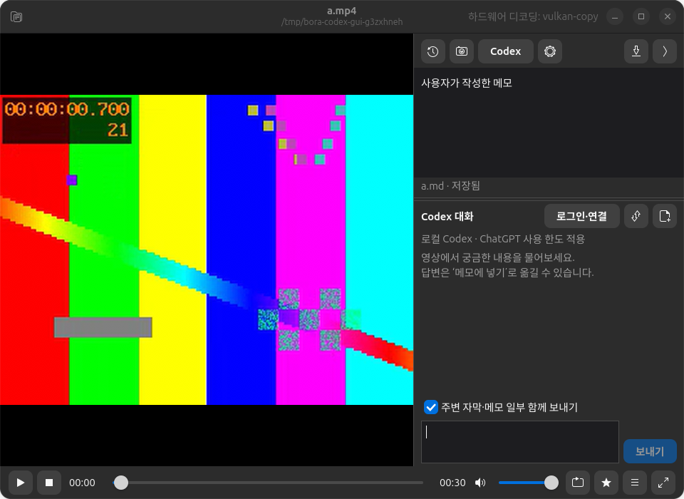

# 로컬 Codex 작업과 대화 — 0.26.3

## 동작

- 기본은 메모 도구막대 Codex / Ctrl+Enter / 메뉴 Codex와 파일 작업.
  저장한 메모의 폴더를 작업 경로로 외부 Codex 터미널을 열고 영상·메모·자막 경로와 질문 전달.
  터미널에서 질문·후속 대화·메모 파일 수정 가능. 작업 권한은 workspace-write/on-request.
- 앱 오른쪽에는 위 메모/아래 Codex 대화를 동시에 표시한다. 탭을 사용하지 않으며 경계선으로 높이 조절.
  추가 대화는 온라인 Codex app-server, ChatGPT 로그인 사용. 유료 API 자동 전환 없음.
- 대화 맥락은 현재 시각, 선택한 주변 자막·메모 일부, 최근 최대20개 메시지.
  답변은 명시적으로 메모에 넣기. 영상별 대화 저장·중지·늦은 응답 무시·초안 복원.
- 외부 메모 변경은 앱에 다시 포커스할 때 확인. 편집이 없으면 불러오고 충돌이면 자동 저장 중지.
  Ctrl+S도 즉시 덮어쓰지 않으며 내 편집을 별도 파일로 보관한 뒤 외부 내용을 읽는 선택 제공.
- API SDK 설치 경로는 제거했다. 이번 작업에서 추가한 Anthropic/OpenAI SDK와 키 저장소 의존 패키지도 제거.

## 디자인 검토

[선정 기록](../research/design-agent-selection-2026-10-06.md)과
[bora-ui-review](../../.claude/skills/bora-ui-review/SKILL.md) 적용.
plugin87의 근거 기반 검수, Layout의 디자인 맥락 전달, Frameground의 실행 결과 반복 검증을 GTK에 맞게 적용.
구현 담당과 독립 검토 담당을 분리했다. 독립 검토가 발견한 문서 전환 불일치,
충돌 강제 덮어쓰기, 손상된 대화의 영상 차단을 수정하고 회귀 검증했다.

## 검증

Ubuntu 26.04, GTK4/libadwaita, Codex CLI 0.160.0.
설정·캐시·대화·영상·메모를 임시 폴더로 격리했다.

- `python3 -m pytest -q`: 216 passed. 실제 서버 요청 없이 프로토콜 하위 프로세스,
  인증 종류 검사, 스트리밍 중복 방지, 실패·취소, 기록 충돌, 안전한 경로 전달 검증.
- 기존 실제 GUI 시나리오 03/06/07/08/10/11 통과, 12는 새 기본 동작에 맞춰 25/25 통과.
- 실제 설치 경로 `/usr/lib/python3/dist-packages/bora`에서 13:31/31, 14:25/25 통과.
- 960×700, 960×560, 720×560, 패널폭320 및 밝은/어두운 테마 실제 GTK 캡처 검사.
  Paned 위치 변경에 따른 할당 검사. 수동 마우스 드래그·스크린리더는 미검증.
- GNOME 터미널 실실행으로 한글·공백 경로 cwd, 실행 인자, API 환경 제거 검증.
  모델 대신 격리된 Python 검사 명령을 사용했다.
- `bash scripts/build-deb.sh` 및 apt 로컬 업그레이드 성공. 설치 버전 0.26.3.

## 현재 제한

로컬 CLI는 ChatGPT 로그인 표시가 있지만 실제 테스트 요청은 401/인증 갱신 실패였다.
앱서버 계정 조회도 유효 계정을 반환하지 않았다. 앱의 Codex 연결 → ChatGPT 로그인에서
사용자가 브라우저 인증을 갱신해야 한다. 실제 계정의 정상 모델 답변은 아직 검증하지 못했다.
보라는 API 키를 사용하지 않으며 로그인 실패를 숨기지 않는다.

외부 터미널과 앱 대화는 독립 세션이다. 터미널의 대화 이력은 Codex가 관리한다.
다른 OS 및 Codex 버전은 실기 검증하지 않았다. 테스트 플레이어는 검증 종료 후 모두 정리한다.
