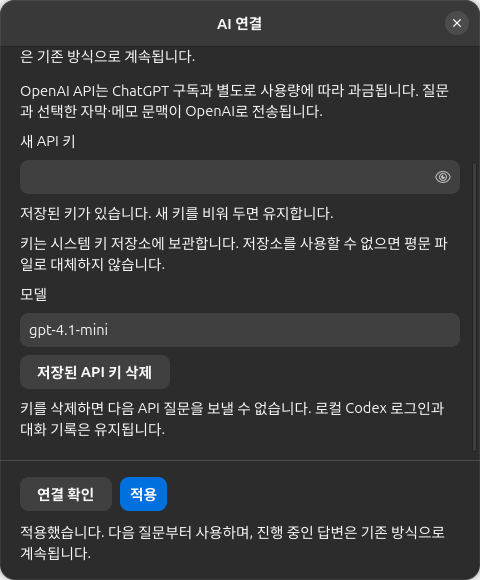
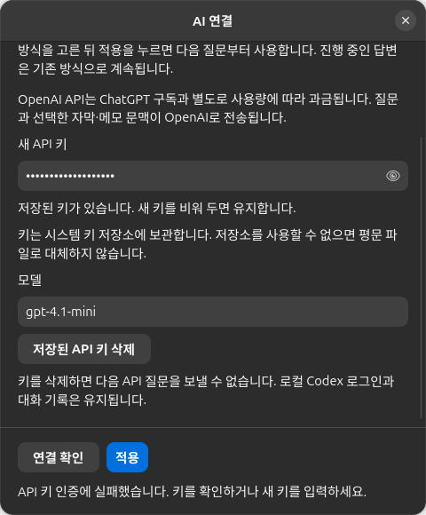
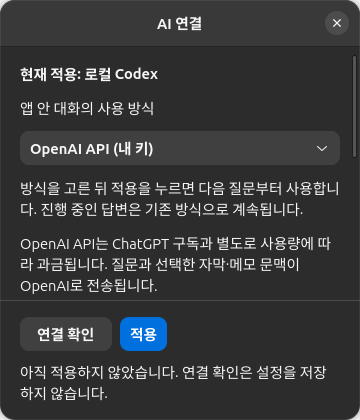

# AI 연결 설정과 OpenAI BYOK — 0.26.5

## 동작

- 환경설정 → AI 연결에서 앱 대화의 사용 방식을 선택한다. 기본은 로컬 Codex이며,
  OpenAI API는 사용자가 내 키 방식을 선택하고 적용할 때만 사용한다. 자동 전환하지 않는다.
- 로컬 방식은 기존 ChatGPT 로그인·연결 확인을 유지한다. 외부 Codex 터미널의 파일 작업은
  앱 대화 방식과 별개로 계속 로컬 Codex를 사용한다.
- API 방식에는 가려진 키 입력과 보기, 모델 입력, 연결 확인, 적용, 저장된 키 삭제가 있다.
  연결 확인은 인증·모델 조회만 수행하며 질문을 보내거나 설정을 저장하지 않는다.
- 방식과 모델은 `ai.json`에 저장하고 키는 시스템 Secret Service에 보관한다.
  키 저장소를 사용할 수 없으면 평문 파일로 대체하지 않는다. 재열기 시 저장된 키 원문을 표시하지 않는다.
- 키 입력을 비워 적용하면 기존 키를 유지한다. 키 삭제는 대화 기록과 Codex 로그인을 지우지 않으며,
  다음 API 요청이 실패했다고 로컬 방식으로 바꾸지 않는다.
- API 대화는 Responses 스트림을 사용한다. 진행 중인 요청은 시작한 방식으로 끝내고
  다음 질문부터 변경된 설정을 사용한다. 대화와 메모에 답변의 실제 제공자를 남긴다.
- 기존 메모 위 / AI 대화 아래 세로 분할, 중지, 메모에 넣기, 영상별 기록 및 전환 보호를 유지한다.

## 독립 UI 검토

[bora-ui-review](../../.claude/skills/bora-ui-review/SKILL.md)를 적용하여
설정 구현 담당과 검토 담당을 분리했다. 주 작업은 영상·메모이며 AI 연결 설정은 보조 창이다.
기존 Adwaita 위젯·시스템 글꼴·강조 버튼을 사용하고 색상만으로 성공과 오류를 구분하지 않는다.

검토 중 다음 문제를 수정했다.

- 잘못된 모델을 적용할 때 키가 먼저 교체되는 순서를 바꾸어 모델을 먼저 검사한다.
- 키 저장은 성공했지만 설정 파일 저장이 실패하면 부분 저장 사실과 다시 적용할 방법을 안내한다.
- 로컬 기본 화면을 열 때 API 키 저장소를 불필요하게 조회하지 않는다.
- 설정 읽기 실패를 계속 읽는 중으로 표시하지 않고 다시 적용할 방법을 안내한다.
- API 설정의 연결 확인·적용·결과 문구가 긴 설정 아래로 밀리지 않도록 하단에 고정했다.

최종 실제 GTK 캡처에서 480×580 기본 창과 360×420 좁은 창을 확인했다.
긴 한국어 문구는 줄바꿈되며 입력 영역은 스크롤할 수 있고 하단 동작과 오류 안내는 보인다.
밝은 테마와 어두운 테마 모두 입력·버튼·상태를 식별할 수 있다.
선택한 방식과 현재 적용된 방식이 구분되고 API 별도 과금 안내가 표시된다.

**설치 전 판정: 통과.** 검토한 범위에서 주요 동작을 막는 UI 결함은 남지 않았다.
스크린리더와 실제 사용자 계정의 유료 API 응답은 이번 판정에 포함하지 않는다.







## 검증

Ubuntu 26.04, GTK4/libadwaita에서 검증했다. 검토 에이전트는 시나리오를 작성하고
캡처를 독립 검토했으며, GUI 접근이 가능한 주 실행 에이전트가 최종 실행을 수행했다.
설정·대화·키 저장소·HTTP를 격리해 사용자 API 키와 자료를 사용하지 않았다.

- `python3 -m pytest -q`: **232 passed**.
- `13-codex-chat.py`: **36/36 통과**. 실제 API runner와 모의 HTTP를 연결하여
  API 스트림, 제공자 기록, 메모 반영 및 기존 대화 회귀를 검증했다.
- `15-byok-settings.py`: **36/36 통과**. 로컬 기본, 선택과 적용 분리, 키 가림,
  질문 없는 모델 조회, 저장·재열기·삭제, 인증 실패 입력 보존, 잘못된 모델,
  키 저장소 실패, 부분 저장 안내, 좁은 창을 검증했다.
- `10-keys-and-logging.py`: 기존 키·메뉴·로그·종료 시나리오 통과.
- 격리한 D-Bus Secret Service에서 키 저장·조회·삭제 실제 동작을 확인했다.
  사용자 키 저장소와 실제 비밀값은 사용하지 않았다.
- 0.26.5 deb 빌드·로컬 설치 완료. 설치된 소스와 검증한 작업 소스의 일치를 확인했다.

GUI 실행 예시:

```bash
GDK_BACKEND=x11 GSETTINGS_BACKEND=memory \
  BORA_REVIEW_SHOTS=/tmp/bora-byok-ui-review \
  python3 .claude/skills/verify-app/scenarios/15-byok-settings.py
```

실행 환경에 맞는 DISPLAY와 XAUTHORITY가 필요하다. API 서버 응답은 모의 데이터이며
실제 계정의 인증·과금·모델 응답은 검증하지 않았다. UI 설치 전 판정에 더해
패키지 빌드·로컬 설치 확인 결과를 반영했다. 다른 OS는 실기 검증하지 않았다.
